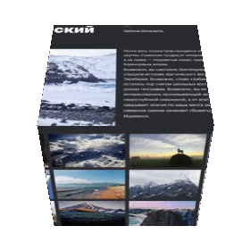

# Russia-trip
Этот проект посвящен путешествию по нашей огромнейшей стране и ее достопримечательностям, таким как Байкал, Полуостров Кольский и многим дргуим. Он позволяет людям посмотреть всю красоту природы от Пскова до Улан-Удэ.
****

[Ссылка на проект](https://pavelcydep.github.io/Russia-adaptiv-verstka/)

## Стек:
- HTML
- CSS

## Инструкции по запуску:
- клонировать репозиторий
- открыть index.html
- 
## Планы на доработку
Улучшить адаптивность и сделать плавнее переходы между контрольными точками.
